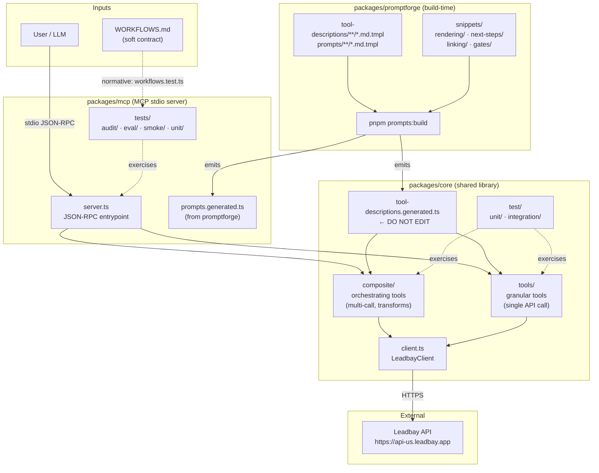

# mcp repo — Claude conventions

> Project-wide guidance for Claude (and any other agent) working in this
> repo. Read this before opening files; the rules below are load-bearing.

## Rendering surface — chat-native markdown + host-native widgets

The Leadbay MCP server **does not ship any custom widgets**. We tried
the MCP Apps `_meta.ui.resourceUri` path through 0.10.0-dev.10 — six
widget packages, full Vite build pipeline, ext-apps SDK. It failed for
two structural reasons:

1. **Iframes don't blend with chat.** Chat hosts rendered our widgets
   as bright sandboxed rectangles in the dark chat thread. MCP Apps's
   theme variables weren't reliably injected, and even when they were,
   iframes can't visually flow with markdown bubbles.
2. **They short-circuited host-native rendering.** When our widget
   auto-rendered, the LLM stopped routing to richer first-party widgets
   (`places_map_display_v0`, `ask_user_input_v0`, `message_compose_v1`)
   because the job felt done.

So tools render via **two surfaces only**:

| Surface | What it covers |
|---|---|
| **Chat-native markdown** (default) | The canonical RENDERING blocks every tool description carries — markdown tables, cards, chips, headings. Inherits the chat's theme, font, link styling for free. Dark-mode-aware on every host. |
| **Host-native widgets** (when the host exposes them) | Claude's three first-party widgets — `places_map_display_v0` for maps, `message_compose_v1` for outreach drafts, `ask_user_input_v0` for NEXT STEPS / clarifications. ChatGPT exposes the same routing pattern via `_meta.openai/outputTemplate`. |

**Do not re-introduce `Tool.ui` bindings.** The field was removed from
the `Tool` interface in 0.10.0-dev.12. Re-adding it would resurrect the
iframe-vs-chat structural problem.

### The three host-native widgets

Every tool whose result fits one of these shapes carries a RENDER
directive naming the widget. Field maps + constraints live in
`packages/promptforge/snippets/gates/builtin-widgets.md`.

| Widget | Use when | Pass shape |
|---|---|---|
| `places_map_display_v0` | ≥2 locations / map / travel intent | `{locations: [{name, address, latitude, longitude, notes}], travel_mode?}` |
| `message_compose_v1` | Drafting outreach (email / call opener) | `{kind, summary_title, variants: [{label, subject?, body}]}` — labels describe STRATEGY, not tone |
| `ask_user_input_v0` | NEXT STEPS / clarifications / quick choices | `{questions: [{question, type:"single_select", options:[2-4 short labels]}]}` (max 3 questions) |

The pattern in a tool description: *"When `<condition>` is true, render
via `<widget_name>`. The following fields map to widget params: `<our
field>` → `<widget param>`, … Do NOT also render as prose / table; the
widget is the answer."* Include `{{include:gates/builtin-widgets}}` in
any tool description where one of the three widgets applies. For NEXT
STEPS specifically, every `snippets/next-steps/*.md` already includes
`{{include:next-steps/ask-user-input-routing}}` at the top — new
NEXT STEPS snippets should do the same.

When a named widget isn't available, the agent falls back automatically
to the markdown RENDERING block. The
**[`leadbay_followups_map`](packages/promptforge/tool-descriptions/composite/followups-map.md.tmpl)**
description is the canonical example — `places_map_display_v0` first,
place-card prose blocks as fallback.

### Embrace the host's address auto-detection

Modern chat hosts (Claude.ai web, cowork, Claude Desktop) auto-detect
addresses + company names in agent prose and render their own
**Google-Place-card carousels** with adjacent prose appearing as "Notes
from Claude". This is high-quality UI we should *feed*, not *fight*.

For geo / travel / "I'm going to <city>" intent, emit per-lead blocks
like:

```
### <Company Name> · <City>, <State>

★ <one-sentence summary>. Reach **[<Contact name>](<LinkedIn URL>)**,
<role>. ☎ <phone>.
```

The host parses these into place cards. **Don't suppress addresses or
fight the auto-detector.** The `leadbay_followup_check_in` prompt's
"TRAVEL / IN-PERSON ROUTING" block is the canonical example.

Crucially: the carousel renders "Notes from Claude" as **plain wrapped
text** — markdown links inside notes show as literal `(https://...)`
visible, newlines collapse, long URLs truncate mid-string. So the
notes string passed to `places_map_display_v0` MUST be short prose with
only bare phone/email inline (those auto-linkify). The LinkedIn-linked
contact name + multi-channel list belongs in the **chat prose AFTER**
the widget invocation, where markdown does render.

## Tool-description structure (5-section convention)

Every user-facing tool description follows the same shape so the agent
always sees routing → render hint → details in a predictable order.
The first two sections are **auto-emitted** by promptforge from the
template's frontmatter — they land in the first ~500 chars of the
generated description, which is the chunk every host loads even when
truncating tool descriptions for context.

```
[1] ## WHEN TO USE        ← auto-emitted from frontmatter.routing
[2] ## RENDER (quick)     ← auto-emitted from frontmatter.rendering_hint
---
[3] <free-form body>      ← what the tool does, params, edge cases
[4] {{include:rendering/…}}   ← detailed RENDERING block
[5] {{include:next-steps/…}}  ← (optional) NEXT STEPS table
```

### Section 1 — `routing` (when to use)

Declare in frontmatter as structured YAML. Promptforge expands it into
a `## WHEN TO USE` markdown block at the head of the description.

```yaml
routing:
  triggers:
    - "show me leads"
    - "today's prospects"
    - "what's new today"
  anti_triggers:
    - phrase: "leads I should follow up with"
      route_to: leadbay_pull_followups
    - phrase: "I'm going to <city>"
      route_to: leadbay_followups_map
  prefer_when: "user has named a specific lens — pass `lensId`"
  examples:
    positive:
      - "Show me today's leads."
      - "What's in my inbox this morning?"
      - "Pull my best new prospects."
    negative:
      - "Which leads should I follow up with this week?"
      - "Show leads I've already contacted."
      - "I'm flying to Berlin Thursday — who should I meet?"
```

The schema follows the consensus best practices from
[Anthropic's skill-author guide](https://www.anthropic.com/engineering/equipping-agents-for-the-real-world-with-agent-skills),
the [mgechev/skills-best-practices](https://github.com/mgechev/skills-best-practices)
collection, and the
[writing-tools-for-agents](https://www.anthropic.com/engineering/writing-tools-for-agents)
practitioner notes. Five conventions worth following:

- **Triggers**: be exhaustive — list the natural phrasings users employ.
  "show me leads", "today's prospects", "let's prospect" — different
  wordings, same intent. The model matches against the union.
- **Anti-triggers**: name the alternative tool. Without anti-triggers
  routing only adds; it never narrows. Cross-routing is what prevents
  misrouting.
- **prefer_when**: a one-sentence hint about decision rules ("user
  named a lens → pass `lensId`"). Used when triggers alone aren't
  enough to disambiguate.
- **Examples (3 positive + 3 negative)**: full-sentence realistic user
  prompts. Positives should invoke this tool; negatives sound similar
  but should route elsewhere. The negatives are the load-bearing half —
  they teach the agent to discriminate. The 3+3 ratio mirrors the
  community guidance; the audit enforces ≥2 of each.
- **Sentence pattern**: the canonical Anthropic-recommended phrasing
  inside the `short_description` is *"Use when X. Don't use it for Y."*
  Write in third-person voice ("Pulls today's leads…"), never
  first-person ("I can pull leads for you…") or second-person ("You
  can use this to pull leads…"). The agent is reading the description —
  not being pitched to.

### Section 2 — `rendering_hint` (quick render recipe)

A 1–3 sentence summary of the canonical rendering. Promptforge wraps
it in a `## RENDER (quick)` block. Detailed algorithm + linking rules
stay in the body's `{{include:rendering/…}}` snippet — this hint is
the "agent quick read" for context-truncated hosts.

```yaml
rendering_hint: |
  3-col markdown table sorted by `score` desc; col 1 = inline-code
  10-segment `▰❖▱` bar + linked company; col 2 = why-fits ≤20 words;
  col 3 = linked contact + title. Full algorithm below.
```

### Section 3 — body (free-form prose)

What the tool does, parameter details, edge cases, error envelopes.
Inherits the existing freedom — same way every existing tool description
is structured.

### Section 4 — detailed `{{include:rendering/…}}` block

The canonical RENDERING markdown — full algorithm, link priorities,
glyph palette. Shared snippets live in
`packages/promptforge/snippets/rendering/`.

### Section 5 — `next_steps` (optional)

Some tools have a NEXT STEPS table; others don't. When set in
frontmatter, the body MUST also `{{include:next-steps/<stem>}}` so the
table appears. The frontmatter field exists for audit cross-checks.

```yaml
next_steps: pull-leads   # snippets/next-steps/pull-leads.md
```

### How to test

1. **Per-tool frontmatter validity** — zod schema in
   `packages/promptforge/src/frontmatter.ts` rejects malformed routing
   at build time.
2. **First-600-chars routing landing** —
   `packages/mcp/test/audit/routing-block.test.ts` asserts every tool
   in `TOOLS_WITH_ROUTING` has the `## WHEN TO USE` section in the
   first 600 chars of the generated description.
3. **Anti-trigger cross-references** — same audit checks every
   `route_to` value resolves to a registered tool name. Catches
   renames + typos.
4. **Example count** — same routing audit asserts ≥2 positive AND ≥2
   negative example messages per routed tool. The 3+3 ratio is the
   target; the audit enforces the floor so a tool can land with 2 of
   each if a third realistic angle doesn't exist.
5. **Budget** —
   `packages/mcp/test/audit/tool-description-source.test.ts` enforces
   the per-tool char cap (17000 today). If a routing block tips a
   description over, trim the BODY — never disable the audit.

When you add a new user-facing tool: declare `routing`,
`rendering_hint`, `next_steps`; add the tool name to
`TOOLS_WITH_ROUTING` in the routing audit; run `pnpm -r test`.

## Tool descriptions are generated, not hand-edited

`packages/core/src/tool-descriptions.generated.ts` and
`packages/mcp/src/prompts.generated.ts` are emitted by
`@leadbay/promptforge` from `.md.tmpl` sources under
`packages/promptforge/{tool-descriptions,prompts,snippets}/`. **Edit the
templates, not the generated files** — your hand-edit will be wiped on
the next promptforge build.

Common shared blocks live in `packages/promptforge/snippets/`:

| Snippet | What it is |
|---|---|
| `rendering/score-bar.md` | Canonical 10-segment `▰❖▱` algorithm |
| `rendering/pull-leads-table.md` | The 3-col discovery table layout |
| `rendering/pull-followups-table.md` | The 4-col follow-up status-badge layout |
| `rendering/research-company-card.md` | Single-record research card |
| `rendering/prepare-outreach-brief.md` | Outreach package layout |
| `linking/contact-linkedin.md` | Contact-LinkedIn linking rules (markdown link patterns the agent emits) |
| `linking/company-socials.md` | Company social-URL pills |
| `next-steps/*.md` | Per-tool NEXT STEPS tables — every one includes the `ask_user_input_v0` routing at the top |
| `gates/builtin-widgets.md` | The three-host-widget table |
| `gates/defer-to-tool-rendering.md` | Reminder that prompts defer layout to tool RENDERING blocks |

Include them via `{{include:rendering/score-bar}}` etc. Don't duplicate
content across templates — extract a snippet if you find yourself
copy-pasting.

## Tool description budget

Each tool description has a per-class char budget (currently 16,000 for
composites). Enforced by
`packages/mcp/test/audit/tool-description-source.test.ts`. If your edit
pushes a description over budget, trim verbose paragraphs **within the
template** — don't disable the audit.

## Workspace test invariant

`pnpm -r test` and `pnpm -r typecheck` must be green on every PR.
Before committing, run the full workspace pass.

## Live exploration when the user asks

When the user says "actually fetch", "probe the API", "query live", run
the call. Don't substitute spec reading for the real response. The test
account credentials are expendable — never rotate them defensively.

## Architecture

The repo is a pnpm monorepo. `core` is the shared library; `mcp` is the MCP stdio server that exposes it.



`packages/dxt` — Claude Desktop `.dxt` bundle (wraps mcp).

## Build pipeline

```
pnpm prompts:build       # .md.tmpl → tool-descriptions.generated.ts + prompts.generated.ts
pnpm -r build            # tsc (core) + tsup (mcp) + esbuild+zip (dxt)
pnpm -r test             # must be green before every PR
pnpm -r typecheck        # must be green before every PR
```

`tsc` vs `tsup`:
- **`tsc`** — used by `core/` (library): compiles file-by-file, emits `.d.ts` for consumers
- **`tsup`** — used by `mcp/` (executable): bundles everything into one `dist/bin.js`

## Adding a new tool — 3 files to write

### 1. Tool implementation

`packages/core/src/composite/my-tool.ts`

```typescript
import type { Tool } from "../types.js";
import { leadbay_my_tool } from "../tool-descriptions.generated.js";

export const myTool: Tool = {
  name: "leadbay_my_tool",
  description: leadbay_my_tool,
  inputSchema: {
    type: "object",
    properties: {
      someParam: { type: "string", description: "..." },
    },
  },
  annotations: { readOnlyHint: true },
  execute: async (args, ctx) => {
    return await ctx.client.get("/some-endpoint");
  },
};
```

### 2. Description template

`packages/promptforge/tool-descriptions/composite/my-tool.md.tmpl`

```markdown
---
name: leadbay_my_tool
kind: tool-description
short_description: |
  One-line summary of what this tool does.
annotations:
  readOnlyHint: true
routing:
  triggers:
    - "phrase that should invoke this tool"
  anti_triggers:
    - phrase: "phrase that sounds similar but routes elsewhere"
      route_to: leadbay_other_tool
  prefer_when: "one-sentence disambiguation hint"
  examples:
    positive:
      - "Show me my leads."
      - "What's new today?"
    negative:
      - "Which leads should I follow up with?"
rendering_hint: |
  Brief description of how to render the output (table, card, etc.)
---

What this tool does and when to use it.

{{include:rendering/score-bar}}
{{include:next-steps/pull-leads}}
```

The frontmatter fields `routing` and `rendering_hint` are auto-emitted by promptforge as `## WHEN TO USE` and `## RENDER (quick)` blocks — guaranteed to land in the first ~600 chars that every host reads.

### 3. Register in the export catalog

`packages/core/src/index.ts`:

```typescript
import { myTool } from "./composite/my-tool.js";

export const compositeReadTools: Tool[] = [
  pullLeads,
  myTool,      // ← add here
  ...
];
```

Use `compositeReadTools` for read-only tools, `compositeWriteTools` for tools that mutate data.

### After writing the 3 files

```bash
pnpm prompts:build   # generates tool-descriptions.generated.ts
pnpm -r build        # compiles everything
pnpm -r test         # must stay green
pnpm -r typecheck    # must stay green
```

If `prompts:build` fails: check `name:` matches filename, `kind: tool-description` is set, every `{{include:...}}` resolves, and `route_to:` values match registered tool names.

Also: add the tool name to `TOOLS_WITH_ROUTING` in `packages/mcp/test/audit/routing-block.test.ts`.

## Composite vs granular

| | Composite | Granular |
|---|---|---|
| **Location** | `core/src/composite/` | `core/src/tools/` |
| **What it is** | High-level workflow | Direct API call |
| **Exposed by default** | Yes | No (`LEADBAY_MCP_ADVANCED=1`) |
| **Logic** | Orchestrates multiple calls, transforms, pagination | Single call, near-raw response |
| **Example** | `pull-leads` — resolves lens, fans out AI scores | `like-lead` — single `POST /leads/:id/like` |

Rule: multiple API calls or business logic → composite. Single relay call → granular.

## Tool exposure — env var gates

| Tools exposed | Condition |
|---|---|
| `agentMemoryTools` + `compositeReadTools` | always |
| `compositeWriteTools` | `LEADBAY_MCP_WRITE=1` (default ON since 0.3.0) |
| `granularReadTools` + `granularWriteTools` | `LEADBAY_MCP_ADVANCED=1` |

New composite tools automatically inherit the right gate based on which array they're added to.

## Writing tests

Every new tool needs a test file. New tests go in new files — never modify existing test files.

```
core/test/unit/composite/my-tool.test.ts   # composite tools
core/test/unit/tools/my-tool.test.ts       # granular tools
```

Boilerplate:

```typescript
import { describe, it, expect, beforeEach } from "vitest";
import { mockHttp, resetHttpMock, httpsMockFactory, getHttpRequests } from "../../harness.js";
import { vi } from "vitest";
vi.mock("node:https", () => httpsMockFactory());

import { LeadbayClient } from "../../../src/client.js";
import { myTool } from "../../../src/composite/my-tool.js";

const BASE = "https://api-us.leadbay.app";
const newClient = () => new LeadbayClient(BASE, "u.test-token", "us");

beforeEach(() => resetHttpMock());

describe("leadbay_my_tool", () => {
  it("happy path — returns expected shape", async () => {
    mockHttp([
      { method: "GET", path: "/my/endpoint", status: 200, body: { items: [{ id: "1" }] } },
    ]);
    const result = await myTool.execute(newClient(), { myParam: "value" });
    expect(result.items).toHaveLength(1);
  });

  it("empty input — no API call", async () => {
    mockHttp([]);
    const result = await myTool.execute(newClient(), { myParam: "" });
    expect(result.items).toHaveLength(0);
    expect(getHttpRequests()).toHaveLength(0);
  });

  it("API error — propagates", async () => {
    mockHttp([{ method: "GET", path: "/my/endpoint", status: 429, body: { code: "QUOTA_EXCEEDED" } }]);
    await expect(myTool.execute(newClient(), { myParam: "value" })).rejects.toThrow();
  });
});
```

`mockHttp([...])` declares HTTP responses in order; the harness intercepts `node:https` and throws if the code hits an undeclared endpoint.

Minimum coverage: happy path + edge case (empty input / boundary) + error/4xx when the tool has error-specific behavior.

## WORKFLOWS.md — soft contract

`WORKFLOWS.md` at the repo root is the canonical map of user intent → MCP assets → tests. It is **not** a test file but it is normative: `packages/mcp/test/audit/workflows.test.ts` asserts every backtick-wrapped `leadbay_*` identifier resolves to a registered tool/prompt/skill and every Tests path exists on disk.

When you add a new tool that enables a new user story: add a row to `WORKFLOWS.md` before opening the PR. When you extend an existing workflow: update the relevant row.
