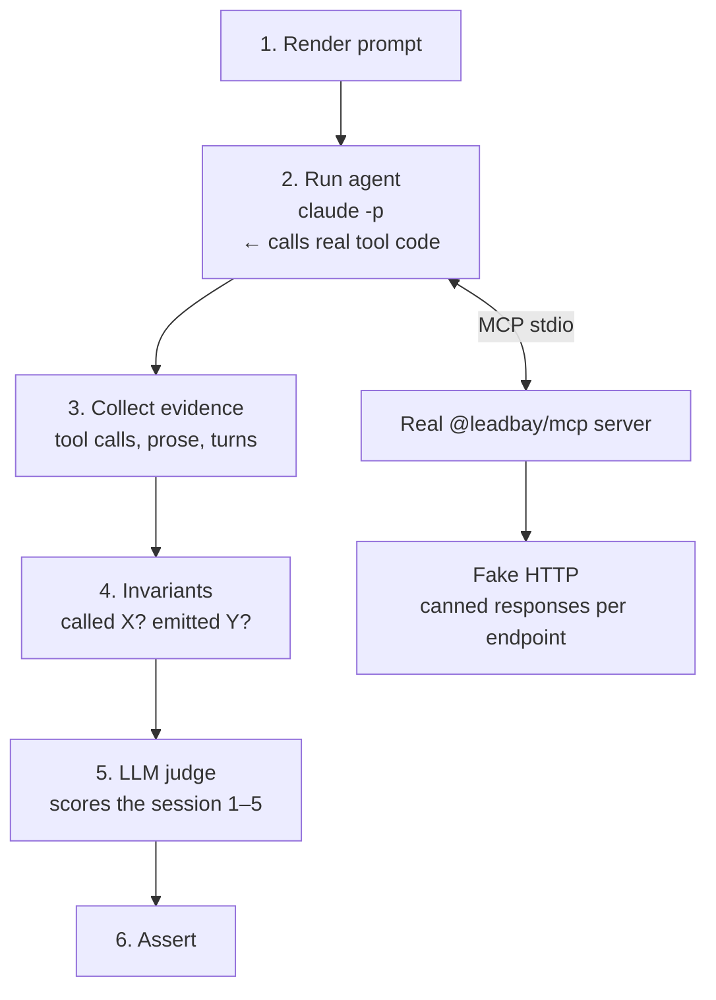

# MCP Eval Framework

Tests that the Leadbay agent behaves correctly end-to-end — right tools, right order, no invented data.

## How it works



The MCP server is real production code. Only the HTTP layer is replaced with static responses defined in each scenario.

The eval runs against your **local build** — rebuild after editing tool handlers:
```bash
pnpm --filter @leadbay/mcp run build
```

## Running

```bash
# one scenario
EVAL=1 EVALS_ALL=1 CLAUDE_CODE_DISABLE_HOOKS=1 \
  pnpm --filter @leadbay/mcp exec vitest run \
  --config vitest.eval.config.ts \
  test/eval/prompts/leadbay_daily_check_in.eval.ts

# full suite
EVAL=1 EVALS_ALL=1 CLAUDE_CODE_DISABLE_HOOKS=1 \
  pnpm --filter @leadbay/mcp exec vitest run \
  --config vitest.eval.config.ts
```

Requires being logged in to Claude Code (`claude /login`).

## Directory structure

```
eval/
  scenarios/       one folder per workflow, one file per scenario
  prompts/         *.eval.ts — one per MCP prompt
  invariants/      cheap deterministic checks (called X? emitted Y?)
  helpers/         run-eval.ts, cli-session-runner.ts, judges, evidence
```

## Adding a scenario

**1. Write the scenario** (`scenarios/<workflow>/<name>.scenario.ts`):
```ts
const ORG_ID = "org_xyz_001";
const LENS_ID = 42;
const P = (path: string) => `/1.5${path}`; // LeadbayClient prepends /1.5

export const SCENARIO = {
  name: "my-scenario",
  prompt: "leadbay_daily_check_in",
  tier: "gate",
  args: {},
  backendFixtures: [
    { method: "GET", path: P("/users/me"), status: 200, body: { ... } },
    // one entry per API call the tool will make — derive paths from the composite source
  ],
  mission: {
    user_intent: "...",
    success_criteria: ["called leadbay_account_status exactly once", ...],
    required_calls: ["leadbay_account_status", "leadbay_pull_leads"],
    required_byproducts: ["STOP — awaiting user decision"],
    forbidden_calls: ["leadbay_report_outreach"],
  },
};
```

**2. Wire it into an eval file** (`prompts/<prompt>.eval.ts`):
```ts
import { runScenarioEval, setupScenarioFixtures } from "../helpers/run-eval.js";
import { SCENARIO } from "../scenarios/daily-check-in/my-scenario.scenario.js";

describe.skipIf(mode === "skip")("eval: leadbay_daily_check_in — my scenario", () => {
  setupScenarioFixtures(SCENARIO);
  it("my-scenario", async () => {
    await runScenarioEval({ scenario: SCENARIO, invariants: dailyCheckInInvariants });
  });
});
```

**3. Add touchfiles** in `helpers/touchfiles.ts` so the scenario runs when relevant files change.

## Scores

Each run prints:
```
mission_match:         4/5   did the agent accomplish the goal?
instruction_adherence: 5/5   did it follow prompt rules?
no_fabrication:        5/5   did it invent data? (must be 5 to pass)
tool_selection_fit:    4/5   right tools, right order?

criteria:
  [✓] called leadbay_account_status exactly once
  [✗] researched only the top-scoring lead
tools called: account_status → pull_leads → research_lead_by_id
turns: 12  duration: 50.5s
```

Thresholds: `mission_match ≥ 4` and `no_fabrication = 5`.
